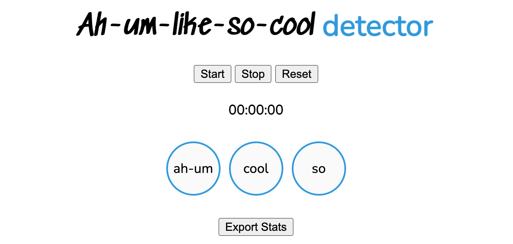

# Ah-um-like-so-cool detector ([try here](https://zackakil.github.io/Ah-um-like-so-cool-detector/))
Real-time voice recognition app to help speakers reduce their use of "filler words".

Primarly use [Teachable Machine](https://teachablemachine.withgoogle.com/) to train Audio recognition model. 

### Features
- [x] Detect filler words
- [x] Count filler words
- [x] Make noise when filler word is said
- [x] export stats

- [ ] Use web bluetooth to trigger anti-incentive
